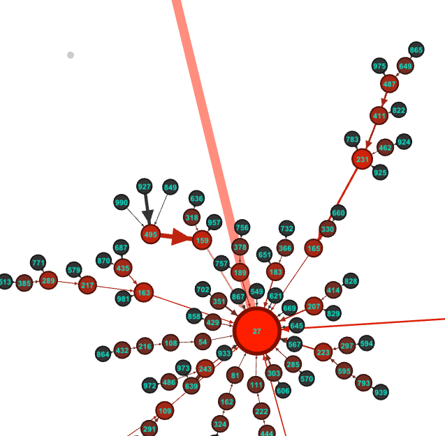

## Exploration: The Hailstone Numbers

_"Mathematics may not be ready for such problems." &mdash; Paul Erdős_


The Collatz Conjecture is one of mathematics most famous unsolved problems.  Its
fame is undoubtedly due to its seeming simplicity. Any third grader can
understand the problem. And it's fun to explore!

Start with any natural number. If it is even, divide it by two. If it is odd
first multiply it by three then add one. If your result is greater than one,
repeat the process again with your result.

For example, start with the number 1. Since it is odd, we multiply it by 3 and
add 1, getting 4. As 4 is greater than 1, we continue. Since 4 is even, we
divide it by 2 to get 2, which of course is greater than 1 and even, so we
divide it by 2 again and we get . . . 1. And we are done.

The Collatz Conjecture, suggested by German Mathematician Lothar Collatz, is
that every natural number subjected to this iterative process will eventually
yield 1.

Let's try 3. We get 10, then 5, then 16, then 8, then 4, then 2, then 1.

Here are the sequences for the numbers 1-9:

  * 1: [4, 2, 1]
  * 2: [1]
  * 3: [10, 5, 16, 8, 4, 2, 1]
  * 4: [2, 1]
  * 5: [16, 8, 4, 2, 1]
  * 6: [3, 10, 5, 16, 8, 4, 2, 1]
  * 7: [22, 11, 34, 17, 52, 26, 13, 40, 20, 10, 5, 16, 8, 4, 2, 1]
  * 8: [4, 2, 1]
  * 9: [28, 14, 7, 22, 11, 34, 17, 52, 26, 13, 40, 20, 10, 5, 16, 8, 4, 2, 1]

These sequences of _iterates_ are sometimes called "hailstone sequences" because
of the way they repeatedly rise and then fall before eventually falling to the
ground (i.e. down to 1.)

As you might imagine, this problem has been deeply investigated by the best
meathematicians in the world. So far, the conjecture has been confirmed for
every natural number up to 2<sup>58</sup>.  But there's still a lot of numbers
between that and infinity. And so far, we have no way of knowing, without
checking, whether all of those numbers' sequences eventually reach one or not.

In fact, we may never have an answer at all. It may be that the Collatz
Conjecture is _formally undecidable_, meaning that a mathematical proof for it
may not even exist!

So, no matter how much time we spend on it, it's pretty unlikely that we'll make
any signficant progress on the problem. And that means the pressure is off! We
can feel free to explore and play around with it all we want; our only goal is
to satify our curiosity and maybe discover what makes such a simple problem to
explain so devilishly difficult to solve.

So let's play.

Here's a python function that returns a given number's hailstone sequence. We
assume the sequence should not include the original number, so the sequence
returned for 1 is `[4, 2, 1]` and not `[1, 4, 2, 1]`.

``` python 
def hailstone(n):
    sequence = []
    while True:
        n = 3*n + 1 if n & 1 else n // 2
        sequence.append(n)
        if n == 1: break
    return sequence
```

Easy peasy. Great, so now let's reproduce our results above for the numbers 1 to 9: 

``` python 
for n in range(1,10):
    print(f"{n}: {hailstone(n)}")
```

No problem. But what now? Well, after looking at the hailstone seqUences for
various numbers we may start to notice some things. First, our sequences always
seem to reach a power of 2, after which they trivially decrease to 1. That makes
sense when we think about it.  The only way for our sequences to decrease is
when we hit an even number and divide by two. That means we must always get to 1
by dividing 2. Similarly, the only way to get to 2 is through 4. So all of our
sequences for n > 4 must end in `[4, 2, 1]`. The only way to get to 4 is either
by multiplying 1 by 3 and adding 1 or by dividing 8 by 2. Since we stop our
sequences when we get to 1, we only get to 4 through dividing 8 by 2 (except in
the special case when we start with 1.) Furthermore, as 8 cannot be expressed as
3k+1, we must get 8 by dividing 16 by 2. So all of our sequences other than
those starting with 8, 4, 2, 1 must end in `[16, 8, 4, 2, 1]`.

Well, that's interesting. It highlights the fact that only some powers of 2 can
be expressed as 3k+1. Upon closer inspection, it appears that it is powers of 4 that
can be expressed as 3k+1. Is that always the case? Spoiler: yes it is. It's an
easy proof by induction.[^proof]


48

[^proof]: Here is a proof that any power of four can be expressed as 3*k*+1.
First, we show that there exists an _n_ such that 4<sup>_n_</sup> can be
expressed as 3*k*+1. This is easy to do. 
Let _n_ = 0. 4<sup>0</sup> = 1 = 3(0) + 1. So, when _n_=0 and _k_=0,
4<sup>_n_</sup> = 3*k*+1. Now, to prove by induction, we must show that _if_
4<sup>_n_</sup> can be expressed as 3*k*+1 _then_ 4<sup>_n_+1</sup> can also be
expressed as 3*k*+1.
Assuming 4<sup>_n_</sup> = 3*m* + 1 
&#8658; 4<sup>_n_</sup> = 4(3*m* + 1)
&#8658; 4<sup>_n_+1</sup> = 12*m* + 4 
&#8658; 4<sup>_n_+1</sup> = 12*m* + 3 + 1 
&#8658; 4<sup>_n_+1</sup> = 3(4*m* + 1) + 1 
&there4; _if_ 4<sup>_n_</sup> = 3*m* + 1 _then_  4<sup>_n_+1</sup> = 3*k* + 1 
(where *k* = 4*m* + 1)


